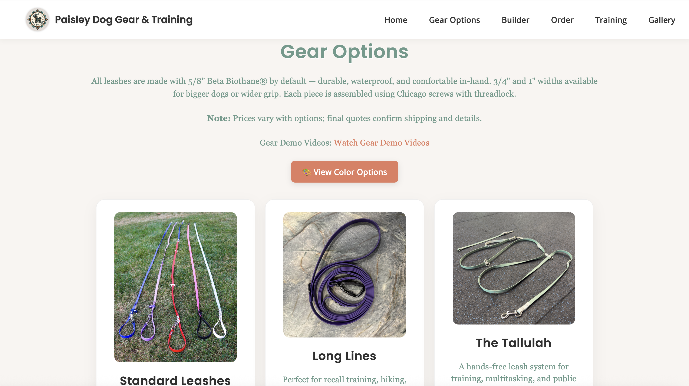
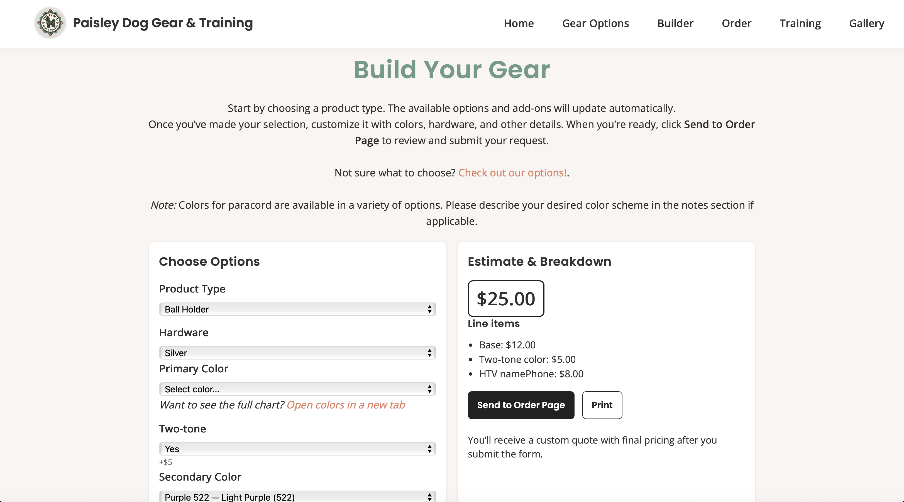

# Paisley Dog Gear & Training

A front-end React.js website for **Paisley Dog Gear & Training**, my small business offering custom Biothane dog gear and professional dog training services.

The site includes interactive forms for training inquiries and gear requests, clear navigation, and brand-consistent design.

**Live site:** [paisleydoggearandtraining.com](https://paisleydoggearandtraining.com)  
**Repo:** [github.com/jpantano30/paisley-dog-gear](https://github.com/jpantano30/paisley-dog-gear)

---

## 🚀 Features

- Responsive front end built with React.js  
- Interactive forms for service requests and inquiries  
- Pages for **Home**, **Options**, **Builder**, **Order**, **Training**, and **Gallery**  
- Clean, branded UI focused on clarity and ease of use  

---

## 🛠️ Tech Stack

- **Frontend:** React.js, JavaScript, HTML, CSS  
- **Version Control:** Git, GitHub  
- **Deployment:** Netlify  

---

## 📂 Project Structure

```text
├─ public/                  # Static files served as-is
│  ├─ assets/               # Images/screenshots used by site & README
│  ├─ _redirects            # Netlify redirect rules
│  ├─ index.html            # Base HTML template for the React app
│  ├─ manifest.json         # PWA/site metadata (name, icons)
│  ├─ robots.txt            # Search engine crawler rules
│  └─ sitemap.xml           # SEO sitemap for indexing
├─ src/                     # Application source code
│  ├─ components/           # Reusable UI components
│  ├─ pages/                # Route-level pages (Home, Services, Builder, Order, Gallery)
│  ├─ App.css               # Global styles for app shell
│  ├─ App.js                # Root component & app routes (main app entry)
│  └─ index.js              # React DOM bootstrap / render root
└─ README.md                # Project overview & setup instructions
```

---

## 🖥️ Getting Started

To run the project locally:

1. Clone the repo  

   ```bash
   git clone https://github.com/jpantano30/paisley-dog-gear.git
   ```

1. Navigate into the folder  

   ```bash
   cd paisley-dog-gear
   ```

1. Install dependencies  

   ```bash
   npm install
   ```

1. Start the development server  

   ```bash
   npm start
   ```

The app will be available at `http://localhost:3000/`.

---

## 📸 Screenshots

### Home Page


### Gear Options



### Builder Page



---

## 🌟 About Paisley Dog Gear & Training

Paisley Dog Gear & Training provides **custom Biothane leashes, collars, and harnesses**, plus balanced training with a focus on fitness, tricks, and everyday obedience.

- Instagram: [@paisleydoggearandtraining](https://www.instagram.com/paisleydoggearandtraining)  
- Website: [paisleydoggearandtraining.com](https://paisleydoggearandtraining.com)

---

## 📄 License

This project is open-source and available under the [MIT License](LICENSE).
